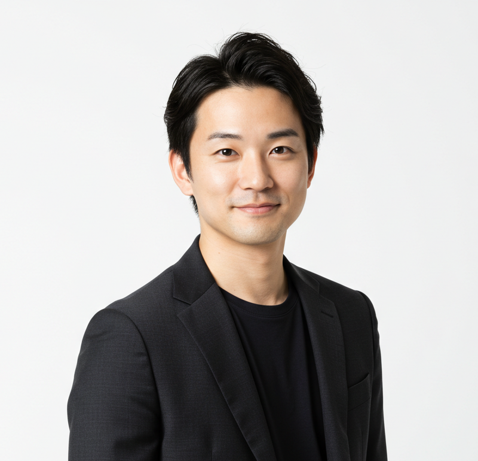

# 職務経歴書

 

山田 太郎(Yamada, Taro)

 

## 職務要約

20xx年に株式会社xxxに入社し、ホテル予約サービスの開発に従事した後、20xx年に株式会社xxxに転職し、賃貸物件検索サービスの開発を担当。

## 経験・スキルセット

- モバイルアプリ、Webフロントエンドの経験と知識
- 後輩エンジニアの育成

## 職務履歴

所属        | 時期              | 役割
---------- | ----------------- | -----------------------------
株式会社xxx | yyyy/mm -         | Application Engineer(Member)
株式会社xxx | yyyy/mm - yyyy/mm | Application Engineer(Member)

## 株式会社xxx(yyyy/mm - yyyy/mm)

#### 主な実績

20xx年に入社し、賃貸物件検索サービスの開発を担当。

- iOSアプリの開発
- OSバージョンアップの対応
- 広告SDK導入対応
- xx機能の開発
- xx機能の開発

(20xx-20xx)5名のチームのメンバーとして参加。  
新規機能として、検索フォームに位置情報から近隣の物件を探す機能を担当。  
位置情報を端末から取得するためのパーミッションの画面について、デザイナーと相談しながらiOSにおいて自然な画面遷移となるよう提案しながら勧めた。  
また、歴史のあるアプリのため、レガシーな実装になっており、UnitTestもないコードだったためバグの検知が手動テストに頼っている状況だった。  
そこで平行して一部のリファクタリングを実施。テスタブルな設計にし、UnitTestを導入したことでサービスの安定性を向上させた。これをきっかけにチームの中でもUnitTestを書いていく文化を根付かせることに繋がった。  

#### チーム構成

5人1チームのメンバー。部署全体では40人ほどエンジニアが所属。

#### 技術スタック

Lang/Framefowrk/Tools | Tech Stack
--- | ---
Programing Language | Swift(v5), Objective-C(v2)
Platform | iOS
UI Framework | UIKit, SwiftUI
Test Framework | XCTest
Libraries | Alamofire, Firebase, Adjust, KARTE
CI/CD | Bitrise, GitHub Actions
Source Management | GitHub
Communication | Slack
Design Collaboration | Figma, Miro
Project Management | GitHub, Jira
Documentation | Confluence

#### Appendix

- [株式会社xxx](https://xxx)
- [xxx賃貸](https://xxx)

## 株式会社xxx(yyyy/mm -)

#### 主な実績

<!-- 主な実績を書く -->

#### チーム構成

<!-- チーム構成を書く -->

#### 技術スタック

Lang/Framefowrk/Tools | Tech Stack
--- | ---
Programing Language | 
Platform | 
Framework | 
DataBase | 
Infrastructure | 
SaaS | 
CI/CD | 
Source Management | 
Communication | 
Design Collaboration | 
Project Management | 
Documentation | 

#### Appendix

- [株式会社xxx](https://xxx)
- [xxxホテル予約](https://xxx)

## Appendix

- [GitHub](https://github.com/aaa)
- [Qiita](https://qiita.com/aaa)
